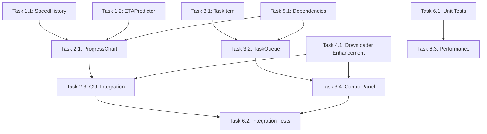

# GUI 进度可视化 - 实现任务清单

## Phase 1: 核心数据结构 (优先级：P0)

### Task 1.1: 实现速度历史记录
- **文件**: `src/webvidgrab/progress.py`
- **类**: `SpeedHistory`
- **验收标准**:
  - [ ] 环形缓冲区，最大 60 秒
  - [ ] 支持添加速度样本
  - [ ] 支持获取最近 N 秒数据
  - [ ] 支持计算平均值
  - [ ] 单元测试通过

### Task 1.2: 实现 ETA 预测器
- **文件**: `src/webvidgrab/progress.py`
- **类**: `ETAPredictor`
- **验收标准**:
  - [ ] 指数加权滑动平均算法
  - [ ] 可配置平滑因子 (alpha)
  - [ ] 支持计算剩余时间
  - [ ] 支持格式化 ETA 显示 (HH:MM:SS)
  - [ ] 单元测试通过

### Task 1.3: 增强进度数据类
- **文件**: `src/webvidgrab/progress.py`
- **类**: `DownloadProgress`
- **验收标准**:
  - [ ] 添加速度历史字段
  - [ ] 添加 ETA 字段
  - [ ] 添加峰值速度字段
  - [ ] 向后兼容现有代码

---

## Phase 2: 图表组件 (优先级：P0)

### Task 2.1: 创建进度图表组件
- **文件**: `src/webvidgrab/gui/progress_chart.py`
- **类**: `ProgressChartWidget`
- **验收标准**:
  - [ ] 使用 PyQtGraph 渲染速度曲线
  - [ ] 1Hz 更新频率
  - [ ] 显示当前速度、平均速度、峰值速度
  - [ ] 显示 ETA 预测
  - [ ] 带宽使用图表
  - [ ] 美观的样式（深色主题）

### Task 2.2: 实现统计信息显示
- **文件**: `src/webvidgrab/gui/progress_chart.py`
- **组件**: `StatsLabel`
- **验收标准**:
  - [ ] 实时显示速度统计
  - [ ] 格式化显示（Mbps 单位）
  - [ ] 样式美观（圆角、背景色）

### Task 2.3: 集成到主窗口
- **文件**: `src/webvidgrab/site_gui.py`
- **修改**: `DownloadGUI` 类
- **验收标准**:
  - [ ] 添加进度图表面板
  - [ ] 左右布局（控制 + 图表）
  - [ ] 可调节窗口大小
  - [ ] 性能测试通过（CPU < 5%）

---

## Phase 3: 任务队列视图 (优先级：P1)

### Task 3.1: 创建任务项组件
- **文件**: `src/webvidgrab/gui/task_queue_view.py`
- **类**: `TaskItemWidget`
- **验收标准**:
  - [ ] 显示 URL
  - [ ] 显示进度条
  - [ ] 显示状态（等待/下载中/完成/失败/已暂停）
  - [ ] 暂停/恢复按钮
  - [ ] 信号/槽机制

### Task 3.2: 创建任务队列容器
- **文件**: `src/webvidgrab/gui/task_queue_view.py`
- **类**: `TaskQueueView`
- **验收标准**:
  - [ ] 滚动区域支持多任务
  - [ ] 动态添加/删除任务项
  - [ ] 按状态排序（下载中优先）
  - [ ] 批量操作支持

### Task 3.3: 实现单任务控制
- **文件**: `src/webvidgrab/downloader.py`
- **方法**: `pause_task()`, `resume_task()`
- **验收标准**:
  - [ ] 支持暂停单个任务
  - [ ] 支持恢复单个任务
  - [ ] 暂停时保存状态
  - [ ] 恢复时验证状态

### Task 3.4: 实现全局控制
- **文件**: `src/webvidgrab/gui/control_panel.py`
- **组件**: `ControlPanel`
- **验收标准**:
  - [ ] "全部暂停"按钮
  - [ ] "全部恢复"按钮
  - [ ] 带宽限制滑块
  - [ ] 并发数调节器

---

## Phase 4: 后端集成 (优先级：P0)

### Task 4.1: 增强下载器速度跟踪
- **文件**: `src/webvidgrab/downloader.py`
- **类**: `ConcurrentDownloader`
- **验收标准**:
  - [ ] 集成 `SpeedHistory`
  - [ ] 实时计算下载速度
  - [ ] 每 30 秒保存状态（断点续传）
  - [ ] 信号通知 GUI 更新

### Task 4.2: 实现实时数据推送
- **文件**: `src/webvidgrab/downloader.py`
- **机制**: PyQt Signal/Slot
- **验收标准**:
  - [ ] 定义 `speed_updated` 信号
  - [ ] 定义 `progress_updated` 信号
  - [ ] 定义 `task_state_changed` 信号
  - [ ] 线程安全（跨线程信号）

### Task 4.3: 集成断点续传
- **文件**: `src/webvidgrab/state_manager.py`
- **修改**: 与 GUI 状态同步
- **验收标准**:
  - [ ] 崩溃后恢复 GUI 状态
  - [ ] 显示恢复进度
  - [ ] 支持手动恢复

---

## Phase 5: 依赖和配置 (优先级：P2)

### Task 5.1: 添加依赖
- **文件**: `requirements.txt`
- **新增包**:
  - [ ] `pyqtgraph>=0.13.0`
  - [ ] `PyQt5>=5.15.0` (或 PyQt6)
  - [ ] `numpy>=1.20.0`

### Task 5.2: 添加 GUI 配置
- **文件**: `src/webvidgrab/config.py`
- **新增配置项**:
  - [ ] `gui.chart_update_interval` (默认 1000ms)
  - [ ] `gui.eta_smoothing_factor` (默认 0.3)
  - [ ] `gui.speed_history_duration` (默认 60 秒)
  - [ ] `gui.theme` (默认 "dark")

### Task 5.3: 更新文档
- **文件**: `docs/GUI.md`, `README.md`
- **验收标准**:
  - [ ] 更新 GUI 功能说明
  - [ ] 添加截图
  - [ ] 更新配置说明
  - [ ] 更新快速入门

---

## Phase 6: 测试和文档 (优先级：P1)

### Task 6.1: 编写单元测试
- **文件**: `tests/test_progress_chart.py`, `tests/test_task_queue.py`
- **验收标准**:
  - [ ] `SpeedHistory` 测试覆盖
  - [ ] `ETAPredictor` 测试覆盖
  - [ ] `ProgressChartWidget` 测试覆盖
  - [ ] `TaskQueueView` 测试覆盖
  - [ ] 代码覆盖率 >= 85%

### Task 6.2: 编写集成测试
- **文件**: `tests/test_gui_integration.py`
- **验收标准**:
  - [ ] 实时图表更新测试
  - [ ] 任务队列控制测试
  - [ ] 断点续恢复测试
  - [ ] 性能测试（CPU/内存）

### Task 6.3: 性能优化
- **文件**: 全局
- **验收标准**:
  - [ ] 图表更新延迟 < 100ms
  - [ ] 内存占用 < 10MB
  - [ ] CPU 占用 < 5%
  - [ ] 无内存泄漏

### Task 6.4: 创建用户文档
- **文件**: `docs/GUI_PROGRESS.md`
- **验收标准**:
  - [ ] 功能说明
  - [ ] 使用示例
  - [ ] 配置说明
  - [ ] 故障排除

---

## Task 依赖关系

---

## 验收标准汇总

### 功能验收
- [ ] AC1: 实时速度图表显示（1Hz 更新）
- [ ] AC2: ETA 预测误差 < ±20%
- [ ] AC3: 任务队列状态可视化
- [ ] AC4: 单任务暂停/恢复
- [ ] AC5: 全局暂停/恢复

### 质量验收
- [ ] 所有单元测试通过
- [ ] 所有集成测试通过
- [ ] 代码覆盖率 >= 85%
- [ ] 性能测试通过
- [ ] 文档完整性审查通过

### 发布验收
- [ ] CHANGELOG.md 更新
- [ ] README.md 更新
- [ ] 截图添加到文档
- [ ] v0.5.0 发布说明

---

## 估算工作量

| Phase | 任务数 | 估算时间 | 依赖 |
|-------|--------|----------|------|
| Phase 1 | 3 | 1 天 | 无 |
| Phase 2 | 3 | 2 天 | Phase 1 |
| Phase 3 | 4 | 2 天 | Phase 2 |
| Phase 4 | 3 | 1 天 | Phase 1, 2 |
| Phase 5 | 3 | 0.5 天 | 无 |
| Phase 6 | 4 | 1.5 天 | 所有 Phase |
| **总计** | **20** | **8 天** | - |

---

**Change**: gui-progress-visualization  
**Version**: 1.0  
**Created**: 2026-03-17  
**Status**: Ready for Implementation  
**Priority**: P0 (v0.5.0 核心功能)
